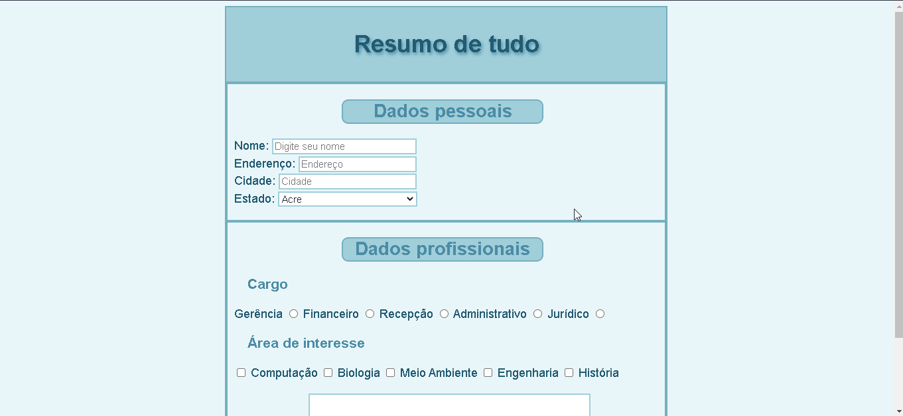

# Resumo-HTML-Intermediario
Resumo de tudo que aprendi de HTML Intermerdiario no curso DevQuest. Neste módulo as tags focadas foram os inputs, a tag select, a tag textarea, a tag button e a tag form. 

<a href="https://ericrdgs.github.io/Resumo-HTML-Intermediario/">=======================================> Acessar o resumo <=======================================</a>
